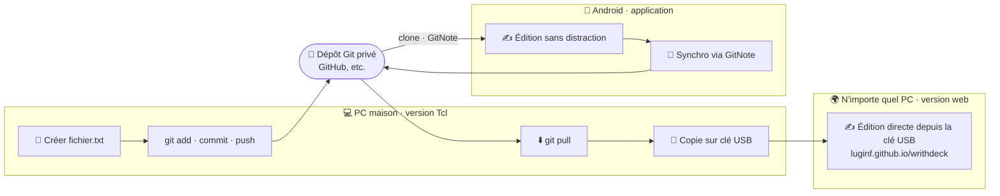

# WrithDeck 


[🇬🇧 English](README.md) — [📖 Manuel](writhdeck_MANUAL.md) — [🌍 Guide i18n](src/i18n/README.md)
 
WrithDeck est un éditeur de texte sans distraction conçu pour les auteurs utilisant un writerdeck dédié — prototype fait maison ou ordinateur configuré spécifiquement pour l'écriture. Il fonctionne comme une application graphique (GUI) ou directement dans un terminal/TTY (TUI), le tout depuis un seul fichier exécutable sans installation.

**Fonctionnalités :**
- Coloration syntaxique inline avec support des marqueurs Markdown et txt2tags
- Navigateur de fichiers avec favoris, fichiers récents et navigation dans les sous-dossiers
- Édition en vue fractionnée (GUI et TUI)
- Second espace de travail (F10) pour éditer deux fichiers indépendants côte à côte (GUI et TUI)
- Table des matières avec navigation par en-têtes
- Interface entièrement thémable (mode sombre/clair, 6 schémas de couleurs)
- Couleurs ANSI en mode TUI (16 couleurs et 256 couleurs, compatible TTY, configurables dans le INI)
- Support multi-langue (Anglais, Français, Allemand, Espagnol, Coréen, Norvégien)
- Raccourcis cliquables dans la barre d'outils
- Outils d'analyse du document : plan de structure, occurrences de mots, détection des répétitions et correction orthographique
- Statistiques d'écriture et suivi du progrès quotidien, avec objectif de mots journalier configurable
- Minuterie configurable (compte à rebours) et chronomètre avec alertes visuelles et notifications sonores
- Mode commande modal (touche ESC) pour accès rapide au minuteur, aux stats et aux occurrences de mots
- ~5 000 lignes de Tcl/Tk, générées à partir de modules source

Que vous écriviez sur un Raspberry Pi Zero avec un écran E-ink, sur une tablette Android, en SSH, ou sur votre bureau, WrithDeck reste léger et vous laisse vous concentrer sur votre texte.


## Installation

Tcl/Tk 8.6+ doit être installé sur votre système :

| Plateforme    | Commande                                                                                         |
| ------------- | ------------------------------------------------------------------------------------------------ |
| Debian/Ubuntu | `apt install tk`                                                                                 |
| Mac OS        | `brew install tcl-tk`                                                                            |
| Windows       | [tcl-lang.org/software/tcltk/bindist.html](https://www.tcl-lang.org/software/tcltk/bindist.html) |
| Haiku OS      | `pkgman install tcl tk`  


Vous pouvez également obtenir des binaires pour Windows, Linux et Mac OS sur https://farvardin.itch.io/writhdeck
                                                                        |

## Démarrage rapide

```sh
wish writhdeck.tcl                     # GUI, navigateur de fichiers
wish writhdeck.tcl file.txt            # GUI, ouvrir un fichier directement
tclsh writhdeck.tcl --tui              # TUI, navigateur de fichiers (--no-gui, --cli aussi acceptés)
tclsh writhdeck.tcl --cli file.txt     # TUI, ouvrir un fichier directement
./writhdeck.tcl --tui                  # Exécution directe, mode TUI
```

Vous pouvez aussi copier `writhdeck.tcl` ou `writhdeck-cli.tcl` dans votre PATH (par exemple `/usr/local/bin/`) pour un accès direct depuis n'importe où. La version `writhdeck-cli.tcl` est TUI uniquement et ne nécessite pas Tk.

📖 Voir le [manuel](writhdeck_MANUAL.md) pour la configuration, les raccourcis clavier et toutes les fonctionnalités.


## Analyse et statistiques d'écriture

WrithDeck embarque un ensemble d'outils pour relire un travail en cours, disponibles aussi bien en GUI qu'en TUI (depuis le navigateur via `a` / `w` / `s`, ou depuis le mode commande modal pendant l'édition) :

- **Plan de structure** (`a`) — un aperçu des chapitres/sections construit à partir de vos en-têtes, avec le total de mots et de sections. Sélectionnez un en-tête pour y sauter directement.
- **Occurrences de mots** (`w`) — la liste de fréquence de chaque mot du document, triée par nombre, pour repérer les termes surutilisés.
- **Détection des répétitions** — signale un même mot (ou lemme) répété dans une portée configurable et, en option, les répétitions *cachées* comme « tour » dans « alentours ». Portée et longueur minimale réglables.
- **Correction orthographique** — vérifie tout le document via Hunspell et liste chaque faute avec des suggestions ; sautez à n'importe quelle occurrence.
- **Statistiques quotidiennes** (`s`) — comptage de mots par jour et par fichier (high-water mark), plus un objectif de mots journalier affiché en direct dans la barre d'état.

Ces outils d'analyse sont optionnels à la compilation (`make ANALYSIS_TOOLS=no` pour les exclure).

## Exemple de workflow

WrithDeck est volontairement agnostique de la plateforme — mêmes raccourcis, mêmes marges larges, que vous écriviez dans un terminal, sur le bureau, sous Android ou dans un navigateur. Un même fichier peut donc vous suivre sur tous vos appareils. Un workflow possible, basé sur Git :



1. Création d'un dépôt Git privé sur GitHub (ou ailleurs).
2. Création d'un nouveau fichier sur le PC depuis la version Tcl.
3. Ajout au suivi Git : `git add fichier.txt`.
4. Commit et push.
5. Récupération du dépôt sur un téléphone Android via [GitNote](https://f-droid.org/packages/io.github.wiiznokes.gitnote/).
6. Édition du fichier en mode « sans distraction » depuis l'app Android (ou depuis Termux).
7. Mise à jour avec GitNote.
8. Récupération du fichier sur le PC via `git pull`.
9. Copie du fichier sur une clé USB.
10. Sur un PC extérieur (bibliothèque, amis), ouverture de [la version web](https://luginf.github.io/writhdeck/writhdeck.html) et travail directement sur la clé USB.

## Compilation depuis les sources

Le dépôt contient des fichiers source modulaires dans `src/` :

```bash
make                              # Compiler avec toutes les langues disponibles
make LANGUAGES="en"               # Compiler l'anglais uniquement (~95 KB)
make LANGUAGES="en fr de es"      # Compiler des langues spécifiques
make clean                        # Supprimer les fichiers générés
make test                         # Lancer les tests de régression (i18n, syntaxe, builds)
```

**Fichiers générés :**
- `writhdeck.tcl` — Version complète GUI+TUI avec toutes les langues sélectionnées
- `writhdeck-cli.tcl` — Version TUI uniquement (pas de dépendance Tk)

Les deux fichiers sont exécutables et peuvent être distribués directement.

## Internationalisation

WrithDeck supporte **6 langues** nativement :
- 🇬🇧 Anglais
- 🇫🇷 Français
- 🇩🇪 Allemand
- 🇪🇸 Espagnol
- 🇰🇷 Coréen
- 🇳🇴 Norvégien

Chaque langue peut être sélectionnée indépendamment via `~/.writhdeck.ini`. Pour ajouter une nouvelle langue, voir [src/i18n/README.md](src/i18n/README.md).

## Structure du code

```
src/
├── boot.tcl            # Bootstrap polyglot sh/Tcl
├── boot-cli.tcl        # Bootstrap TUI uniquement
├── state.tcl           # Persistance JSON (curseurs, favoris, stats)
├── config.tcl          # Chargement INI, thèmes, i18n
├── common.tcl          # Utilitaires partagés (backup, parseurs inline)
├── gui.tcl             # Implémentation GUI (Tk)
├── tui.tcl             # Implémentation interface TUI
├── main.tcl            # Dispatch GUI/TUI
├── main-cli.tcl        # Point d'entrée CLI
└── i18n/
    ├── en.tcl          # Traductions anglaises
    ├── fr.tcl, de.tcl, es.tcl, ko.tcl, no.tcl
    └── README.md       # Guide i18n

tests/
├── test-i18n.tcl       # Validation des traductions
├── test-syntax.tcl     # Vérification syntaxe Tcl
└── README.md           # Documentation des tests

Makefile                # Système de build, cibles de test
```

## Tests

Des tests de régression complets préviennent les bugs et assurent la qualité :

```bash
make test           # Lancer tous les tests
make test-i18n      # Tester les traductions
make test-syntax    # Vérifier la syntaxe Tcl
make test-gui       # Tester le build GUI
make test-cli       # Tester le build CLI
make test-langs     # Tester les combinaisons de langues
```

Les tests détectent automatiquement :
- Traductions manquantes ou incomplètes
- Incohérences dans les chaînes de format
- Erreurs de syntaxe Tcl
- Échecs de build avec différentes combinaisons de langues

Voir [tests/README.md](tests/README.md) pour plus de détails.

## Développement

Le projet utilise Claude Code pour le développement :

```bash
# Lancer l'éditeur interactif
claude-code .

# Lancer en mode rapide
/fast
```

Voir [CLAUDE.md](CLAUDE.md) pour les directives de codage et conventions.

## Configuration

WrithDeck stocke sa configuration dans `~/.writhdeck.ini` :

```ini
[editor]
profile = default
scheme = dark
lang = fr

[behaviour]
line_numbers = true
cursor_restore = true
dark_mode = true

[keys]
key_save = Control-s
key_open = Control-o
# ... (tous les raccourcis sont configurables)
```

Documentation complète : voir l'aide intégrée (Ctrl+H) ou [writhdeck_MANUAL.md](writhdeck_MANUAL.md).

## Performance

- **Taille :** 95 KB (anglais uniquement) à 280 KB (6 langues)
- **Mémoire :** Empreinte minimale, adaptée aux Raspberry Pi et systèmes embarqués
- **Démarrage :** < 1 seconde sur du matériel moderne
- **Coloration syntaxe :** Temps réel, sans lag même sur des fichiers > 100 KB

## Compatibilité

- **Tcl/Tk :** 8.6+ (toutes les plateformes)
- **GUI (wish) :** X11 (Linux), Aqua (macOS), Win32 (Windows)
- **TUI (tclsh) :** Toutes les plateformes, fonctionne en SSH
- **Testé sur :** Debian, Ubuntu, macOS 12+, Windows 10+, Raspberry Pi OS

**Non supporté :**
- TUI sous Windows (absence de `stty`)
- macOS < 10.14

---

## Crédits

Basé sur [writerdeckForCMD](https://github.com/lallero7/writerdeckForCMD),
lui-même basé sur [bee-write-back](https://github.com/shmimel/bee-write-back/).

Conçu pour fonctionner en Tcl/Tk avec l'aide d'un LLM (Claude Code). [Tcl est un langage remarquable !](https://en.wikipedia.org/wiki/Tcl_(programming_language))

## Licence

Copyright (C) 2026 par Luginfo — Licence BSD Zero Clause

Permission d'utiliser, copier, modifier et/ou distribuer ce logiciel à toute fin avec ou sans frais est accordée. Le logiciel est fourni « en l'état » sans garantie d'aucune sorte.
