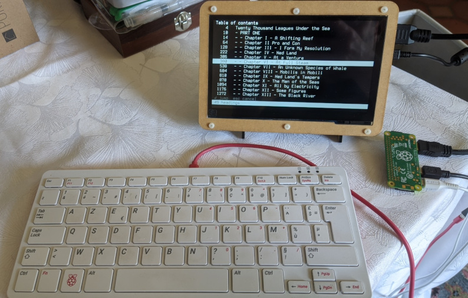
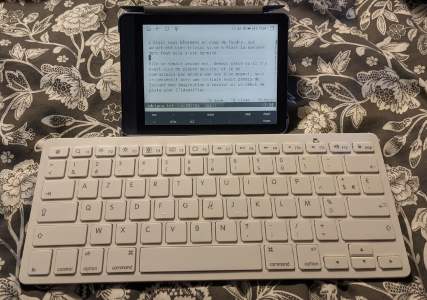

 
# WrithDeck 


[🇫🇷](README.fr.md) 

WrithDeck is a distraction-free text editor designed for writers using a dedicated writerdeck, whether it's a DIY prototype or a computer configured specifically for that purpose. It's fast and easy to customize. WrithDeck can run as a clean graphical application or directly in a terminal or TTY, all from a single file with no installation required.

It includes customizable inline syntax highlighting, a file browser, split view, chapter navigation through a table of contents, and a fully themeable interface, all around 4,300 lines (185 Kb) of Tcl/Tk.

Whether you're writing on a Raspberry Pi Zero with an E-ink screen, on an Android tablet, over SSH, or on your desktop, WrithDeck stays lightweight and lets you focus on your text.

It has GUI and TUI dual mode with similar behaviors, and is fully configurable.


## Usage

You will need Tcl/Tk on your system.

On Debian-based systems:

``apt install tk``

On other Linux / BSD, refer to your documentation — installation should be trivial.

On Windows, Tcl runtime binaries are available here: https://www.tcl-lang.org/software/tcltk/bindist.html

On Mac OS, use ``brew install tcl-tk`` if you have [homebrew](https://brew.sh/).

On Haiku OS, Tcl/Tk is available via HaikuPorts (``pkgman install tcl tk``). Both GUI and TUI modes work.

Then:

```
wish writhdeck.tcl                     # GUI, file browser
wish writhdeck.tcl file.txt            # GUI, open file directly
tclsh writhdeck.tcl --no-gui           # TUI, file browser
tclsh writhdeck.tcl --no-gui file.txt  # TUI, open file directly
```

You can also run it from the terminal with ./writhdeck.tcl or, better, copy it into your PATH (e.g. /usr/local/bin/) for direct access.


## Command-line options

| Option | Description |
|---|---|
| `--help`, `-h` | Show help and exit |
| `--gui` | Force GUI (Tk) mode — skip display server detection |
| `--no-gui` | Force TUI (terminal) mode |
| `--tui`, `--ng` | Aliases for `--no-gui` |

When both `--gui` and `--no-gui` are given, `--no-gui` takes precedence.


## Features

- Plain `.txt` file editor focused on distraction-free writing
- Documents stored in `~/Documents/writhdeck/` (auto-created)
- File browser: files sorted by modification date, open / create / rename / delete / scratchpad
- Word-wrapped display with configurable margins
- **Inline syntax highlighting** (GUI and TUI):
  - Headings: configurable marker (`= title =`) and Markdown (`# title`)
  - Comments: lines starting with `%` (configurable `comment_marker`)
  - Bold `**text**`, italic `//text//`, underline `__text__`, strikethrough `--text--` — all markers configurable
  - Marker characters greyed out; styled text in a configurable `color_markup`
- Table of contents overlay: jump to any heading (last selection remembered per session)
- Status bar: fully configurable zones (left / center / right) with tokens: `filename dirty sel ln col words chars clock help_bar space`
- Go to line
- UTF-8 input support
- Cursor position restored across sessions (`.writhdeck.json`)
- Configuration reloaded on each new document open (no restart needed)
- Dark/light theme toggle (`Ctrl+D` by default, configurable)
- Interface language: `lang = en` or `fr`
- **Unified browser behavior**: after closing a file, both GUI and TUI return to the file browser (configurable via `browser`)
- **Scratchpad**: temporary in-memory buffer, no disk file until explicitly saved
- **Help dialog**: shows selection word/char count when text is selected (GUI and TUI)


---

## Configuration

`~/Documents/writhdeck/writhdeck.ini` — sections: `[editor]`, `[behaviour]`, `[keys]`, `[profiles]`, `[schemes]`

All keyboard shortcuts are configurable via the `[keys]` section.

### Key INI options

**`[editor]`**

| Key | Default | Description |
|---|---|---|
| `profile` | `default` | Active profile — must match a `[name]` block in `[profiles]` |
| `scheme` | `default` | Active color scheme — must match a `[name]` block in `[schemes]` |
| `console_margin_cols` | `6` | Horizontal margin in columns (TUI only) |
| `console_margin_rows` | `4` | Vertical margin in lines (TUI only) |
| `heading_marker` | `=` | Heading delimiter (`= title =`) |
| `comment_marker` | `%` | Line comment prefix; set to `0` or leave empty to disable |
| `bold_marker` | `**` | Bold inline marker; set to `0` or leave empty to disable |
| `italic_marker` | `//` | Italic inline marker; set to `0` or leave empty to disable |
| `underline_marker` | `__` | Underline inline marker; set to `0` or leave empty to disable |
| `strikethrough_marker` | `--` | Strikethrough inline marker; set to `0` or leave empty to disable |

**`[behaviour]`**

| Key | Default | Description |
|---|---|---|
| `browser` | `1` | Return to file browser after closing a file |
| `watch_file` | `1` | Detect external file modifications and prompt to reload; `0` to disable |
| `split_shrink_margin` | `1` | Halve `margin_width` in split view (GUI); `0` to keep the full margin |
| `hemingway_mode` | `0` | When typewriter mode is active: block arrows, backspace and undo; hide status bar; double margins |
| `console_center_alert` | `1` | Center confirm dialogs (TUI); `0` = bottom bar |
| `block_cursor_gui` | `1` | Block cursor in GUI mode |
| `block_cursor_console` | `1` | Block cursor in TUI mode |
| `blink_cursor` | `0` | Blinking cursor |
| `line_numbers` | `0` | Show line numbers |
| `cursor_restore` | `1` | Restore cursor position on reopen |
| `lang` | `en` | Interface language (`en` or `fr`) |
| `dark_mode` | `1` | Dark theme; `0` = light (Solarized-style) |

**`[keys]`** — all actions are rebindable: `key_save`, `key_close`, `key_find`, `key_replace`, `key_goto`, `key_open`, `key_undo`, `key_redo`, `key_help`, `key_toc`, `key_line_numbers`, `key_fullscreen`, `key_split`, `key_split_focus`, `key_typewriter`, `key_dark_toggle`. Use Tk key names (`Control-s`, `Alt-Return`, `F11`, etc.).

**`[profiles]`** — named presets for GUI display settings. Each `[name]` block defines margins, fonts, and line spacing. Select the active profile with `profile = name` in `[editor]`. The `[default]` profile is always written by WrithDeck.

| Key | Default | Description |
|---|---|---|
| `margin_width` | `60` | Horizontal padding in pixels (GUI) |
| `margin_height` | `40` | Vertical padding in pixels (GUI) |
| `font_size` | `13` | Font size (GUI) |
| `font_family` | `Mono` | Font family (GUI); Tk resolves `Mono` to the best available monospace per OS |
| `bar_font_family` | `Mono` | Font family for the status bar (GUI) |
| `line_spacing` | `100` | Line spacing in % (GUI) |
| `bar_height` | `18` | Status bar height in pixels (GUI) |

Example:

```ini
[editor]
profile = novel

[profiles]

[novel]
margin_width    = 180
margin_height   = 80
font_size       = 18
font_family     = Noto Serif
line_spacing    = 110
bar_height      = 20
```

**`[schemes]`** — color scheme definitions. Each `[name]` block inside `[schemes]` defines a scheme with dark and light mode colors. Select the active scheme with `scheme = name` in `[editor]`. The `[default]` scheme is always written by WrithDeck and holds the current colors.

Color keys per scheme:

| Key | Description |
|---|---|
| `color_bg` / `color_bg_alt` | Editor background (dark / light) |
| `color_fg` / `color_fg_alt` | Editor text (dark / light) |
| `color_bg_bar` / `color_bg_bar_alt` | Status bar background (dark / light) |
| `color_fg_bar` / `color_fg_bar_alt` | Status bar text (dark / light) |
| `color_bg_sel` / `color_bg_sel_alt` | Selection background (dark / light) |
| `color_heading` / `color_heading_alt` | Heading color (dark / light) |
| `color_comment` / `color_comment_alt` | Comment / dimmed line color (dark / light) |
| `color_markup` / `color_markup_alt` | Inline markup color (dark / light) |

Toggle between dark and light with `Ctrl+D` (configurable via `key_dark_toggle`).

Example — to use Solarized, add `scheme = solarized` in `[editor]`, then this block:

```ini
[schemes]

[default]
# … (written automatically by WrithDeck)

[solarized]
# dark mode
color_bg       = #002b36
color_fg       = #839496
color_bg_bar   = #073642
color_fg_bar   = #657b83
color_bg_sel   = #586e75
color_heading  = #b58900
color_comment  = #586e75
color_markup   = #268bd2
# light mode
color_bg_alt      = #fdf6e3
color_fg_alt      = #657b83
color_bg_bar_alt  = #eee8d5
color_fg_bar_alt  = #93a1a1
color_bg_sel_alt  = #d3cbb7
color_heading_alt = #b58900
color_comment_alt = #93a1a1
color_markup_alt  = #268bd2

[gruvbox]
# dark mode
color_bg       = #282828
color_fg       = #ebdbb2
color_bg_bar   = #1d2021
color_fg_bar   = #a89984
color_bg_sel   = #504945
color_heading  = #fabd2f
color_comment  = #928374
color_markup   = #83a598
# light mode
color_bg_alt      = #fbf1c7
color_fg_alt      = #3c3836
color_bg_bar_alt  = #ebdbb2
color_fg_bar_alt  = #7c6f64
color_bg_sel_alt  = #d5c4a1
color_heading_alt = #b57614
color_comment_alt = #a89984
color_markup_alt  = #076678

[everforest]
# dark mode
color_bg       = #2b3339
color_fg       = #d3c6aa
color_bg_bar   = #1e2326
color_fg_bar   = #a7c080
color_bg_sel   = #3a464c
color_heading  = #a7c080
color_comment  = #7a8478
color_markup   = #7fbbb3

# light mode
color_bg_alt      = #fdf6e3
color_fg_alt      = #5c6a72
color_bg_bar_alt  = #efead4
color_fg_bar_alt  = #8da101
color_bg_sel_alt  = #e6e2cc
color_heading_alt = #8da101
color_comment_alt = #a6b0a0
color_markup_alt  = #3a94c5

[nord]
# dark mode
color_bg       = #2e3440
color_fg       = #d8dee9
color_bg_bar   = #3b4252
color_fg_bar   = #81a1c1
color_bg_sel   = #434c5e
color_heading  = #88c0d0
color_comment  = #616e88
color_markup   = #8fbcbb

# light mode
color_bg_alt      = #eceff4
color_fg_alt      = #2e3440
color_bg_bar_alt  = #e5e9f0
color_fg_bar_alt  = #5e81ac
color_bg_sel_alt  = #d8dee9
color_heading_alt = #5e81ac
color_comment_alt = #4c566a
color_markup_alt  = #5e81ac

[alt01]
# dark mode
color_bg       = #1a1214
color_fg       = #e8dcc8
color_bg_bar   = #241820
color_fg_bar   = #9e8878
color_bg_sel   = #521828
color_heading  = #e63060
color_comment  = #6e5858
color_markup   = #c24868
# light mode
color_bg_alt      = #fffde9
color_fg_alt      = #363c42
color_bg_bar_alt  = #eee8d5
color_fg_bar_alt  = #93a1a1
color_bg_sel_alt  = #f0e7c1
color_heading_alt = #c8064a
color_comment_alt = #aaaaaa
color_markup_alt  = #7e1c3e
```


---

## GUI mode

This is the default mode and requires Tk.

**Display**
- Graphical window with scrollable editor and file browser
- Configurable pixel margins, font size and family, line spacing, colors (via INI)
- Inline syntax highlighting: headings, comments, bold, italic, underline, strikethrough
- Line numbers: synchronized with scrolling (`line_numbers = 1`)
- Dynamic font resizing: Ctrl++ / Ctrl+- (keyboard and numpad)
- Fullscreen toggle (default: Alt+Enter, configurable)
- Built-in light theme (toggle with `dark_mode` or `Ctrl+D`)
- Optional second documents folder (`docs_dir`), shown as two labeled sections in the browser
- Clock (HH:MM) in the status bar: add the `clock` token to a status zone
- Block cursor: inverted-color rectangle (`block_cursor_gui = 1`)
- Configurable status bar height (`bar_height`); font size adapts automatically
- **Vertical split view** (F3): splits the editor into two independent panes on the same document; each pane scrolls and positions the cursor independently; F4 cycles focus between panes; the active pane is highlighted with a border
- **Typewriter / focus mode** (Ctrl+T, GUI and TUI): keeps the cursor vertically centered while typing; dims all text outside the current paragraph to reduce distractions
- **Hemingway mode** (`hemingway_mode = 1` in INI, activated with Ctrl+T): forward-only writing — arrows, backspace and undo are disabled; status bar is hidden; margins are doubled. "Write drunk, edit sober!"
- Confirm dialogs: `Tab` to navigate between buttons, `Enter` to confirm, `Escape` to cancel, `y` / `n` for direct answer

**Shortcuts — Editor**

These are the default keys. Most are fully configurable in writhdeck.ini!

| Key | Action |
|---|---|
| Ctrl+S | Save |
| Ctrl+Shift+S | Save as… (with overwrite confirmation) |
| Ctrl+Q | Close file, return to browser |
| Ctrl+F | Find (inline bar, live highlighting, counter) — operates on the active pane in split view |
| Ctrl+R | Find & Replace (inline bar; Enter: replace one, Ctrl+Enter: all) |
| Ctrl+Z | Undo |
| Ctrl+Y | Redo |
| Ctrl+T | Typewriter / focus mode (toggle) |
| Ctrl+O | Open any file (system dialog) |
| Ctrl+G | Go to line — jumps in the active pane |
| Ctrl+H | Help dialog (date/time, file stats, selection stats if text selected) |
| Ctrl+L | Show/hide line numbers |
| Ctrl+D | Toggle dark/light theme |
| Ctrl+↑ / Ctrl+↓ | Jump to previous / next paragraph |
| Ctrl+← / Ctrl+→ | Jump to previous / next word |
| F11 | Table of contents — jumps in the active pane |
| F3 | Toggle split view (GUI only) |
| F4 | Split view — cycle focus between panes |
| Alt+Enter | Fullscreen toggle |
| Tab | Insert 4 spaces |
| Shift+↑↓←→ | Extend selection |

**Shortcuts — Browser**

| Key | Action |
|---|---|
| Enter / double-click | Open file |
| n | New file |
| t | Scratchpad (in-memory buffer, no disk file; Ctrl+S prompts for a name to save) |
| f | Toggle favorite — adds/removes the file from the Favorites section |
| b | Backup file — copies to `backups/` subfolder with a `name_YYYY-MM-DDTHHhMM` timestamp |
| d | Delete file |
| r | Rename file |
| i | Show full path |
| z | Reload — relaunch WrithDeck with the current `.ini` configuration |
| h / Ctrl+H | Help |
| Ctrl+O | Open any file (system dialog) |
| Ctrl+D | Toggle dark/light theme |
| Alt+Enter | Fullscreen toggle |
| q | Quit |

**Split view notes**
- F3 splits the document into two side-by-side panes; press F3 again to close the split
- F4 cycles focus between the two panes (configurable via `key_split_focus`)
- The active pane is highlighted with a colored border; the inactive pane has none
- Both panes share the same text — edits in one are immediately visible in the other
- Cursor, scroll position, and undo history are independent per pane
- Find, Replace, Go to line, and TOC all operate on the pane that had focus when they were opened
- Line numbers are hidden while split is active


---

## TUI mode

Activated via `--no-gui` / `--tui` / `--ng`, or when no windowing system is available. Pure TTY/terminal via ANSI sequences.

**Display**
- Same feature set as the GUI editor, rendered in the terminal
- Browser with `»` selection marker; section headers for dual-folder mode
- Vim-style navigation (j/k) + arrow keys, Home/End, PgUp/PgDn
- Inline syntax highlighting: headings (bold), comments (dimmed), bold/italic/underline/strikethrough
- Scroll indicator: `▐/│` bar in the rightmost column when content overflows
- Line numbers: left column (`line_numbers = 1`), shown on the first visual line of each paragraph
- Status bar: filename, position, word/char count, clock
- Help dialog shows selection word/char count when text is selected
- Configurable cursor shape: block or bar, blinking or steady (`block_cursor_console`, `blink_cursor`)
- Confirm dialogs centered on screen by default (`console_center_alert = 1`)
- Confirm dialogs: `y` / `n` for direct answer, `Escape` to cancel, `Enter` to confirm active button
- **Typewriter / focus mode** (Ctrl+T): cursor kept vertically centered; text outside current paragraph dimmed
- **Hemingway mode** (`hemingway_mode = 1`): activated with Ctrl+T — blocks arrows, backspace and undo; doubles margins
- After closing a file, returns to browser if `browser = 1` (default)

**Shortcuts — Editor**

| Key | Action |
|---|---|
| Ctrl+S | Save (scratchpad: prompts for filename, then saves to disk) |
| Ctrl+Q / Esc | Close file, return to browser |
| Ctrl+F | Find (prompt; repeat to find next) |
| Ctrl+R | Find & Replace (global, with replacement counter) |
| Ctrl+Z | Undo (100-state stack) |
| Ctrl+Y | Redo |
| Ctrl+T | Typewriter / focus mode (toggle) |
| Ctrl+O | Save and return to browser |
| Ctrl+G | Go to line |
| Ctrl+H | Help (date/time, file stats, selection stats if text selected) |
| Ctrl+L | Show/hide line numbers |
| Ctrl+D | Toggle dark/light theme (reverse video) |
| Ctrl+↑ / Ctrl+↓ | Jump to previous / next paragraph (terminal emulator only; intercepted by TTY console) |
| Ctrl+← / Ctrl+→ or Alt+B / Alt+F | Jump to previous / next word |
| F11 | Table of contents (Esc / Ctrl+Q to close, Enter to jump) |
| Ctrl+A | Select all |
| Ctrl+K | Toggle sticky selection (first press: anchor; second press: cancel) |
| Shift+↑↓←→ | Extend selection |
| Ctrl+C | Copy (via xclip / xsel / wl-copy) |
| Ctrl+X | Cut |
| Ctrl+V | Paste (multi-line supported) |
| Tab | Insert 4 spaces |

**Shortcuts — Browser**

| Key | Action |
|---|---|
| Enter | Open file |
| n | New file |
| t | Scratchpad (in-memory buffer, no disk file; Ctrl+S prompts for a name to save) |
| f | Toggle favorite — adds/removes the file from the Favorites section |
| b | Backup file — copies to `backups/` subfolder with a `name_YYYY-MM-DDTHHhMM` timestamp |
| d | Delete file |
| r | Rename file |
| i | Show full path |
| h / Ctrl+H | Help |
| q / Ctrl+Q | Quit |


---

## Screenshots

WrithDeck on a Raspberry Zero W (table of contents mode):



WrithDeck in Termux on an Android Meebook M6 e-reader, with a Bluetooth keyboard:




## Known bugs and limitations

- In GUI mode, line endings in word-wrapped text can cause inconsistent block cursor display. To fix this, use the non-block cursor in the .ini file (block_cursor_gui = 0).
- There is occasionally a slight delay displaying the inverted characters under the block cursor in GUI mode. See the fix above or use TUI mode.
- In TUI mode, resizing the terminal window may produce artifacts. Opening help with Ctrl+H twice refreshes the screen.
- There is no no-wrap mode (and this is not a planned feature).
- There is no tab mode (and this is not a planned feature).
- Split view is only available in GUI (a TUI adaptation may come later).
- On very long texts (over 80,000 words) and a slow CPU machine (2013 Celeron 1.1 GHz), the cursor and typing may slow down. Optimizations have been made compared to the first version, but if needed, disable word and character counting in the status bar. Writing stats remain accessible in the help dialog.


## Credits

Based on <https://github.com/lallero7/writerdeckForCMD>,
itself based on <https://github.com/shmimel/bee-write-back/>

Designed to run in Tcl/Tk with the help of an LLM (Claude Code).

Tcl is a remarkable language! https://en.wikipedia.org/wiki/Tcl_(programming_language)


Nano, micro or scite are also excellent tools for a simple writerdeck.

  
## License

Copyright (C) 2026 by Luginfo

    Zero-Clause BSD License

    Permission to use, copy, modify, and/or distribute this software for any
    purpose with or without fee is hereby granted.

    THE SOFTWARE IS PROVIDED "AS IS" AND THE AUTHOR DISCLAIMS ALL WARRANTIES
    WITH REGARD TO THIS SOFTWARE INCLUDING ALL IMPLIED WARRANTIES OF
    MERCHANTABILITY AND FITNESS. IN NO EVENT SHALL THE AUTHOR BE LIABLE FOR
    ANY SPECIAL, DIRECT, INDIRECT, OR CONSEQUENTIAL DAMAGES OR ANY DAMAGES
    WHATSOEVER RESULTING FROM LOSS OF USE, DATA OR PROFITS, WHETHER IN AN
    ACTION OF CONTRACT, NEGLIGENCE OR OTHER TORTIOUS ACTION, ARISING OUT OF
    OR IN CONNECTION WITH THE USE OR PERFORMANCE OF THIS SOFTWARE.
