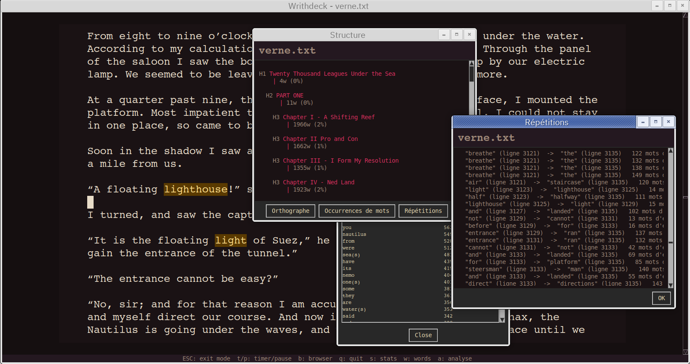
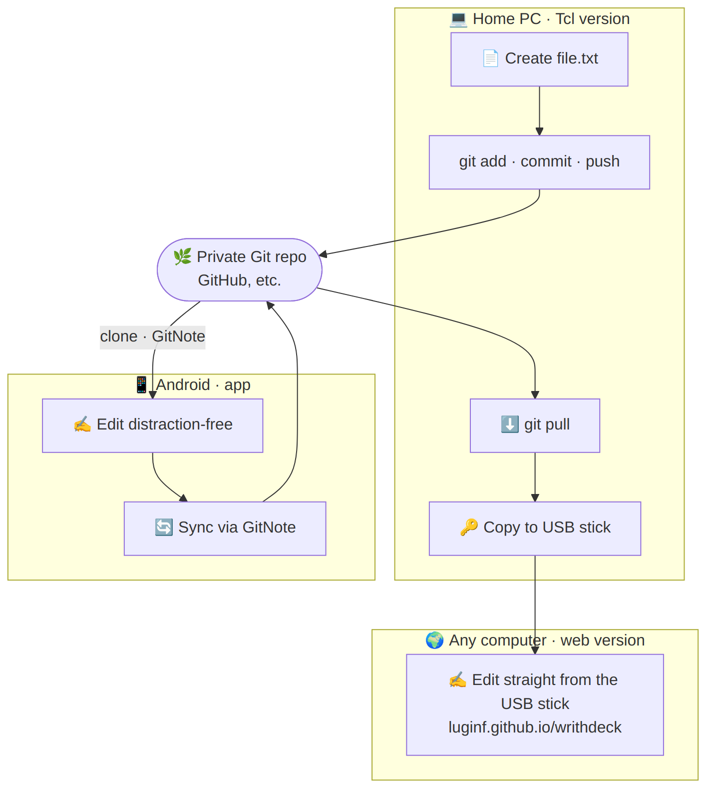

# WrithDeck 


[🇫🇷](README.fr.md) — [📖 Manual](writhdeck_MANUAL.md) — [🌍 i18n Guide](src/i18n/README.md)
 
WrithDeck is a distraction-free text editor designed for writers using a dedicated writerdeck — a DIY prototype or a computer configured specifically for writing. It runs as a graphical application (GUI) or directly in a terminal/TTY (TUI), all from a single executable file with no installation required.

**Features:**
- Inline syntax highlighting with support for markdown and txt2tags markers
- File browser with favorites, recent files, and subfolder navigation
- Split view editing, customise margins size (GUI and TUI)
- Second workspace (F10) for side-by-side editing of two independent files (GUI and TUI)
- Table of contents with heading navigation
- Fully themeable interface (dark/light mode, 6 built-in color schemes)
- ANSI color support in TUI (16-color and 256-color, TTY-compatible, configurable in INI)
- Multi-language support (English, French, German, Spanish, Korean, Norwegian)
- Clickable toolbar shortcuts
- Document analysis tools: structure outline, word occurrences, repetition detection, and spell checking
- Read-only file handling: status bar shows `read-only`, and saving offers to save under a new name
- Writing statistics and daily progress tracking, with a configurable daily word goal
- Configurable timer (countdown) and stopwatch with visual alerts and audio notifications
- Modal command mode (ESC key) for quick access to timer, stats, and word occurrences
- ~5,000 lines of Tcl/Tk, generated from modular source files

Whether you're writing on a Raspberry Pi Zero with an E-ink screen, on an Android tablet, over SSH, on your desktop or from a browser, WrithDeck stays lightweight and lets you focus on your text.


## Other versions

- [Try it online!](https://luginf.github.io/writhdeck/)
- [Android version](https://github.com/luginf/writhdeck-android)
- [ESP32 version (work in progress)](https://github.com/luginf/writhdeck-esp32)


## Installation

Requires Tcl/Tk 8.6+ on your system:

| Platform      | Command                                                                                          |
| ------------- | ------------------------------------------------------------------------------------------------ |
| Debian/Ubuntu | `apt install tk`                                                                                 |
| Mac OS        | `brew install tcl-tk`                                                                            |
| Windows       | [tcl-lang.org/software/tcltk/bindist.html](https://www.tcl-lang.org/software/tcltk/bindist.html) |
| Haiku OS      | `pkgman install tcl tk`                                                                          |


You can also get bundles for Windows, Linux and Mac OS on https://farvardin.itch.io/writhdeck


## Quick Start

```sh
wish writhdeck.tcl                     # GUI, file browser
wish writhdeck.tcl file.txt            # GUI, open file directly
tclsh writhdeck.tcl --tui              # TUI, file browser (--no-gui, --cli aliases)
tclsh writhdeck.tcl --cli file.txt     # TUI, open file directly
./writhdeck.tcl --tui                  # Direct execution, TUI mode
```

You can also copy `writhdeck.tcl` or `writhdeck-cli.tcl` to your PATH (e.g. `/usr/local/bin/`) for direct access from anywhere. The `writhdeck-cli.tcl` version is TUI-only and doesn't require Tk.

📖 See the [manual](writhdeck_MANUAL.md) for configuration, keyboard shortcuts, and all features.


## Writing analysis & statistics

WrithDeck bundles a set of tools to review work in progress, available in both the GUI and the TUI (from the browser via `a` / `w` / `s`, or from the modal command mode while editing):

- **Structure outline** (`a`) — a chapter/section overview built from your headings, with total word and section counts. Pick a heading to jump straight to it.
- **Word occurrences** (`w`) — a frequency list of every word in the document, sorted by count, to spot overused terms.
- **Repetition detection** — flags the same word (or lemma) repeated within a configurable range and, optionally, *hidden* repetitions such as "tour" inside "alentours". Scope and minimum length are configurable.
- **Spell checking** — checks the whole document through Hunspell and lists each misspelling with suggestions; jump to any occurrence directly.
- **Daily statistics** (`s`) — per-file daily word counts (high-water mark), plus a configurable daily word goal shown live in the status bar.

These analysis tools are optional at build time (`make ANALYSIS_TOOLS=no` to exclude them).



## Example workflow

WrithDeck is deliberately platform-agnostic — same shortcuts, same generous margins, whether you write in a terminal, on the desktop, on Android, or in a browser. A single file can therefore follow you across every device. One possible Git-based workflow:



1. Create a private Git repository on GitHub (or elsewhere).
2. Create a new file on your PC with the Tcl version.
3. Stage it: `git add file.txt`.
4. Commit and push.
5. Clone the repository on an Android phone using [GitNote](https://f-droid.org/packages/io.github.wiiznokes.gitnote/).
6. Edit the file in distraction-free mode from the Android app (or from Termux).
7. Sync your changes back with GitNote.
8. Pull the file back to your PC with `git pull`.
9. Copy the file onto a USB stick.
10. On any outside computer (a library, a friend's place), open [the web version](https://luginf.github.io/writhdeck/writhdeck.html) and edit the file directly from the USB stick.


Note that instead of using Git, you can also use a cloud-based service (Google Drive, OneDrive, mega.nz) or a self-hosted service such as Nextcloud.


## Building from Source

The repository contains modular source files in `src/`:

```bash
make                              # Build with all available languages
make LANGUAGES="en"               # Build English only (~95KB)
make LANGUAGES="en fr de es"      # Build specific languages
make clean                        # Remove generated files
make test                         # Run regression tests (i18n, syntax, builds)
```

**Output files:**
- `writhdeck.tcl` — Full GUI+TUI version with all selected languages
- `writhdeck-cli.tcl` — TUI-only version (no Tk dependency)

Both files are executable and can be distributed as-is.

## Internationalization

WrithDeck supports **6 languages** out of the box:
- 🇬🇧 English
- 🇫🇷 French
- 🇩🇪 German
- 🇪🇸 Spanish
- 🇰🇷 Korean
- 🇳🇴 Norwegian

Each language can be independently selected via `~/.writhdeck.ini`. To add a new language, see [src/i18n/README.md](src/i18n/README.md).

## Code Structure

```
src/
├── boot.tcl            # Polyglot sh/Tcl bootstrap
├── boot-cli.tcl        # TUI-only bootstrap
├── state.tcl           # JSON state persistence (cursors, favorites, stats)
├── config.tcl          # INI file loading, theme system, i18n
├── common.tcl          # Shared utilities (backup, inline parsing)
├── gui.tcl             # GUI (Tk) implementation
├── tui.tcl             # Terminal UI implementation
├── main.tcl            # GUI/TUI dispatch
├── main-cli.tcl        # CLI entry point
└── i18n/
    ├── en.tcl          # English translations
    ├── fr.tcl, de.tcl, es.tcl, ko.tcl, no.tcl
    └── README.md       # i18n guide

tests/
├── test-i18n.tcl       # Translation validation
├── test-syntax.tcl     # Tcl syntax checking
└── README.md           # Test suite documentation

Makefile                # Build system, test targets
```

## Testing

Comprehensive regression tests prevent bugs and ensure code quality:

```bash
make test           # Run all tests
make test-i18n      # Test translations
make test-syntax    # Test Tcl syntax
make test-runtime   # Runtime checks (globals/procs present after load)
make test-units     # Unit tests (parsers, state persistence, status bar)
make test-gui       # Test GUI build
make test-cli       # Test CLI build
make test-langs     # Test language combinations
```

Tests automatically detect:
- Missing or incomplete translations
- Format string mismatches
- Tcl syntax errors
- Build failures with different language combinations

See [tests/README.md](tests/README.md) for details.

## Development

The project uses Claude Code for development:

```bash
# Run interactive editor
claude-code .

# Run with fast mode (faster output)
/fast
```

See [CLAUDE.md](CLAUDE.md) for coding guidelines and conventions.

## Configuration

WrithDeck stores configuration in `~/.writhdeck.ini`:

```ini
[editor]
profile = default
scheme = dark
lang = en

[behaviour]
line_numbers = yes    # inline comments are supported
cursor_restore = yes
dark_mode = yes

[tui_colors]
tui_colors = yes      # enable ANSI colors in TUI/TTY
tui_256colors = yes   # 256-color mode (numeric 0-255 accepted)
tui_col_heading = 214
tui_col_bar_bg = 94

[keys]
key_save = Control-s
key_open = Control-o
# ... (all shortcuts configurable)
```

Full documentation: See the in-app help (Ctrl+H) or [writhdeck_MANUAL.md](writhdeck_MANUAL.md).

## Performance

- **Size:** 95KB (English only) to 280KB (all 6 languages)
- **Memory:** Minimal footprint, suitable for Raspberry Pi and embedded systems
- **Startup:** <1 second on modern hardware
- **Syntax highlighting:** Real-time, with zero lag even on 100KB+ files

## Compatibility

- **Tcl/Tk:** 8.6+ (all platforms)
- **GUI (wish):** X11 (Linux), Aqua (macOS), Win32 (Windows)
- **TUI (tclsh):** All platforms, works over SSH
- **Tested on:** Debian, Ubuntu, macOS 12+, Windows 10+, Raspberry Pi OS

**Not supported:**
- Windows TUI (no `stty` command)
- macOS < 10.14

---

## Credits

Based on [writerdeckForCMD](https://github.com/lallero7/writerdeckForCMD),
itself based on [bee-write-back](https://github.com/shmimel/bee-write-back/).

Designed to run in Tcl/Tk with the help of an LLM (Claude Code). [Tcl is a remarkable language!](https://en.wikipedia.org/wiki/Tcl_(programming_language))

## License

Copyright (C) 2026 by Luginfo — Zero-Clause BSD License

Permission to use, copy, modify, and/or distribute this software for any purpose with or without fee is hereby granted. The software is provided "as is" without warranty of any kind.
